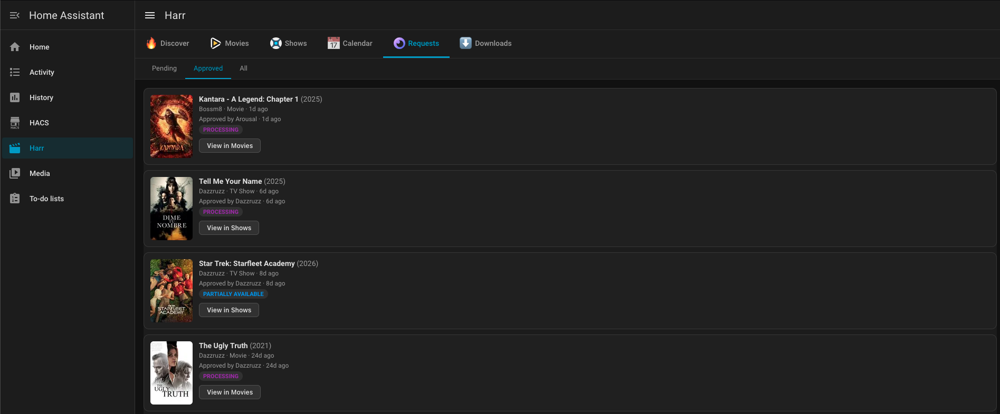
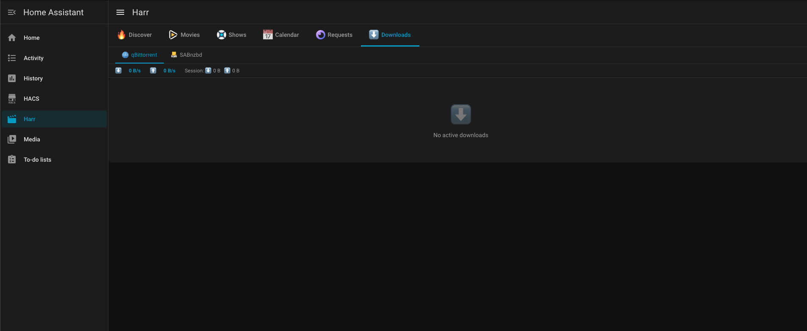

# Harr

<p align="center"></p>

A Home Assistant custom integration that brings [nzb360](https://nzb360.com/)-style media management into your HA sidebar. Manage your entire media stack from one place without leaving Home Assistant.

**Supported services:**

| Service | Features |
| --- | --- |
| [Radarr](https://radarr.video/) | Browse movie library, search & add movies, quality profiles |
| [Sonarr](https://sonarr.tv/) | Browse TV library, search & add shows, quality profiles |
| [Seerr](https://docs.seerr.dev/) | Pending requests, approve / decline, discover trending & upcoming |
| [Bazarr](https://www.bazarr.media/) | Missing subtitles, trigger subtitle search |
| [qBittorrent](https://www.qbittorrent.org/) | Active torrents, speed, pause / resume / delete |
| [SABnzbd](https://sabnzbd.org/) | NZB queue, speed, pause / resume / delete |

All services are **optional** — configure only the ones you use.

---

## Requirements

- Tested with Home Assistant **2026.2.3+**
- The services you want to manage must be reachable from the HA host

---

## Installation

### Option A — Manual

1. Copy the `custom_components/harr/` folder into your HA config directory:

   ```text
   <config>/
   └── custom_components/
       └── harr/          ← copy this folder here
           ├── __init__.py
           ├── manifest.json
           ├── config_flow.py
           ├── ...
           └── frontend/
               └── harr-panel.js
   ```

2. Restart Home Assistant.

3. Go to **Settings → Integrations → + Add Integration**, search for **Harr**, and follow the setup wizard.

### Option B — HACS (custom repository)

> **Prerequisites:** [HACS](https://hacs.xyz/) must be installed.

1. In HACS, open the **⋮** menu (top-right) and choose **Custom repositories**.
2. Enter the repository URL (e.g. `https://github.com/bossm8/harr`) and set the category to **Integration**, then click **Add**.
3. The **Harr** integration now appears in HACS. Click **Download** and confirm.
4. Restart Home Assistant.
5. Go to **Settings → Integrations → + Add Integration**, search for **Harr**, and follow the setup wizard.

---

## Configuration

### Via the UI (recommended)

During the setup wizard, enter the connection details for each service you want to use. **Leave the URL blank to skip a service.**

| Field | Description |
| --- | --- |
| URL | Base URL including port, e.g. `http://192.168.1.10:7878` |
| API Key | Found in each app under **Settings → General** |
| Username / Password | qBittorrent only |
| Verify SSL | Uncheck to allow self-signed certificates |

After saving, the **Harr** entry appears in your sidebar immediately.

To update credentials later: **Settings → Integrations → Harr → Configure**.

### Via `configuration.yaml`

Add a `harr:` block — useful when managing HA as code or using secrets:

```yaml
harr:
  radarr:
    url: http://192.168.1.10:7878
    api_key: !secret radarr_api_key
    verify_ssl: false

  sonarr:
    url: http://192.168.1.10:8989
    api_key: !secret sonarr_api_key

  seerr:
    url: http://192.168.1.10:5055
    api_key: !secret seerr_api_key

  bazarr:
    url: http://192.168.1.10:6767
    api_key: !secret bazarr_api_key

  qbittorrent:
    url: http://192.168.1.10:8080
    username: admin
    password: !secret qbt_password

  sabnzbd:
    url: http://192.168.1.10:8080
    api_key: !secret sabnzbd_api_key
```

Add secrets to `secrets.yaml`:

```yaml
radarr_api_key: abc123...
sonarr_api_key: def456...
seerr_api_key: ghi789...
bazarr_api_key: jkl012...
qbt_password: hunter2
sabnzbd_api_key: mno345...
```

Restart HA after editing. The integration is created automatically — no UI wizard needed.

> **Note:** If a config entry already exists (from the UI), editing `configuration.yaml` and restarting will update the existing entry's credentials in-place.

---

## Frontend / JS panel

The JavaScript panel is bundled inside the integration and served automatically at `/harr-frontend/harr-panel.js` once the integration is configured. No separate installation is needed.
The documentation about this can be found [here](https://community.home-assistant.io/t/how-to-add-a-sidebar-panel-to-a-home-assistant-integration/981585).

---

## Sidebar panel

After setup, **Harr** appears as a sidebar entry with a movie icon. Click it to open the full-screen panel.

### Tabs

| Tab | Service | What you can do |
| --- | --- | --- |
| **Discover** | Seerr | Browse trending, upcoming, popular movies & shows; request media |
| **Movies** | Radarr | Browse library, search TMDB, add movies with quality profile & root folder |
| **Shows** | Sonarr | Browse library, search TVDB, add shows with quality profile & root folder |
| **Calendar** | Radarr / Sonarr | Monthly release calendar for upcoming movies & episodes |
| **Requests** | Seerr | Review pending requests; approve or decline |
| **Downloads** | qBittorrent / SABnzbd | Live queue with progress, speed, ETA; pause / resume / delete |

---

## Adding a dashboard card

Harr is a **sidebar panel**, not a Lovelace card, so it lives at `/harr` in the sidebar. However, you can add a navigation button card on any dashboard to jump directly to it:

```yaml
type: button
name: Media Manager
icon: mdi:movie-open
tap_action:
  action: navigate
  navigation_path: /harr
```

Or with a picture-elements card for a richer look:

```yaml
type: picture-elements
image: /local/harr-banner.jpg   # optional custom background
elements:
  - type: icon
    icon: mdi:movie-open
    style:
      top: 50%
      left: 50%
      color: white
      "--mdc-icon-size": 48px
    tap_action:
      action: navigate
      navigation_path: /harr
```

---

## Proxy architecture

All API calls go through HA's HTTP server, so:

- Your service credentials **never reach the browser** — they are injected server-side.
- The panel authenticates with HA using the standard Bearer token; HA then proxies to each service.
- API endpoints follow the pattern `/api/harr/{service}/{path}`, e.g.:

  ```http
  GET /api/harr/radarr/api/v3/movie
  POST /api/harr/seerr/api/v1/request/42/approve
  GET /api/harr/qbittorrent/api/v2/torrents/info
  ```

---

## Troubleshooting

### Panel does not appear in sidebar

- Check **Settings → Integrations** — the Harr entry must be present and show no errors.
- Check HA logs for `custom_components/harr` errors.

### "Service not configured" in the panel

- The URL for that service is blank in the integration config. Go to **Settings → Integrations → Harr → Configure** and fill it in.

### SSL certificate errors

- Uncheck **Verify SSL** for the affected service, or add your CA certificate to HA's trust store.

### qBittorrent returns 403

- Check that the username/password are correct. Harr automatically re-authenticates on session expiry.

### Changes to `configuration.yaml` not picked up

- Restart Home Assistant (a reload is not sufficient for initial entry creation from YAML).

---

## Preview






---

## Development

This repo has also a devcontainer docker-compose stack with the following basic services:

- Development container on internal docker network (no direct internet access)
- Squid proxy to proxy and filter requests coming from the devontainer, connected to the internet. (Note: I used this repo also to get familiar with squid proxy, so there might be features not relevant for basic proxying with the harr use-case)
- Home Assistant container to mount and test the harr integration on the fly

## Notes

- This is a vibe-coded project, I'm no application developer, although I tried to follow docs and verified stuff, there could be bugs. I did not invest a huge time, and don't plan to do so, so use at your own risk.
- The main idea was to have a nzb360 like integration for myself, so maintenance is not guaranteed.
- This project is an independent, unofficial integration and is not affiliated with, endorsed by, or connected to nzb360 or any of the Servarr projects.
